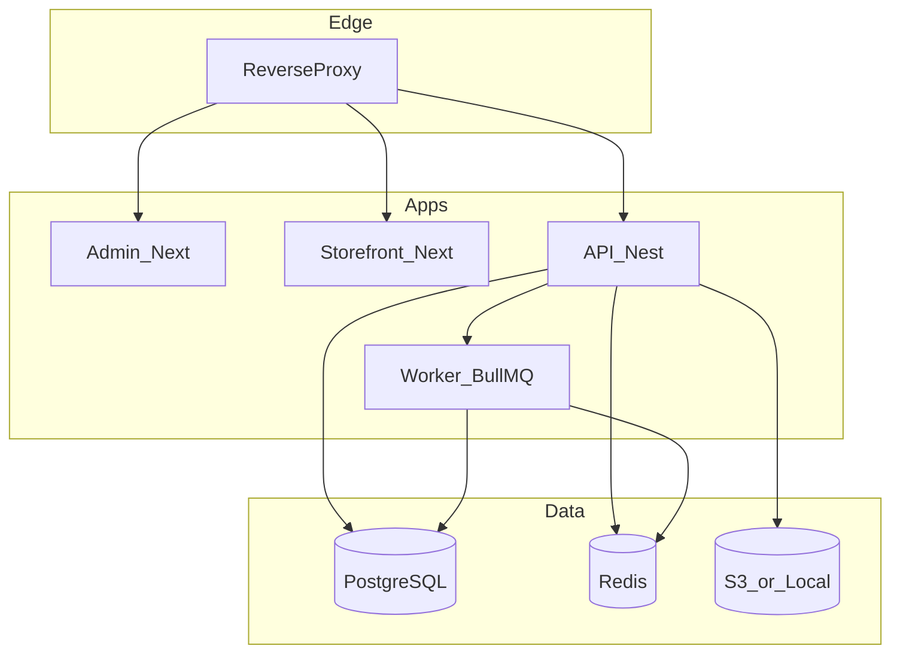
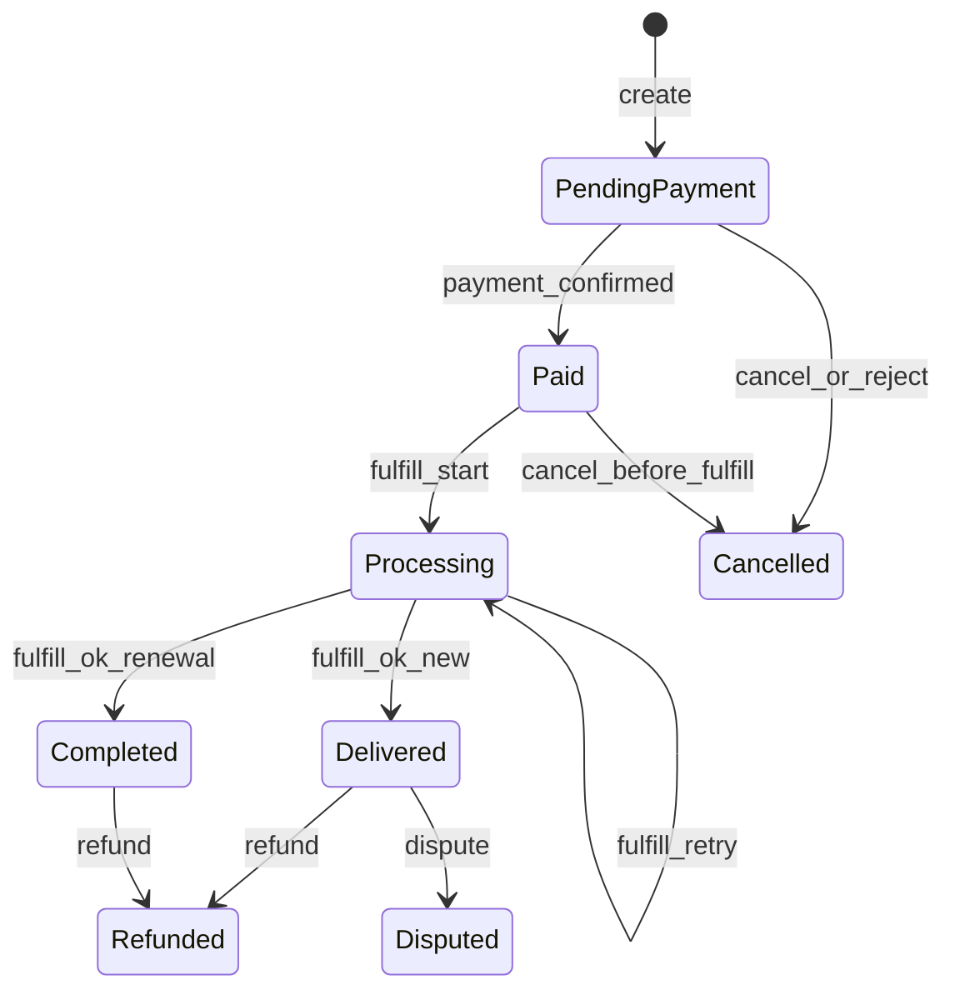

# NeoStore — Master Product Spec (PRD + Build Bible)

**Product:** NeoStore  
**Document:** SPEC v1.0  
**Repo:** `D:/NeoStudio/sample/Projects/hmray/server/NeoStore` (standalone — no dependency on other panels)  
**Status:** Source of truth for design & implementation

---

## 0. How to read this document

| Layer | Meaning |
|-------|---------|
| **Vision** | Long-term Marketplace Platform (multi-tenant, wallets, settlements, many product types) |
| **Priority build (P0)** | First shippable vertical = **Store Core** (catalog, checkout, orders, customers, portal, Telegram Mini App / bot, manual payments, pluggable delivery) |
| **Later (P1+)** | Full marketplace: multi-workspace economics, wallet ledger, more gateways, tickets, reviews, affiliates, … |

**Build rule:** Implement P0 completely and production-ready before expanding P1. Architecture must not block P1 (multi-tenant Workspace from day one).

---

## 1. Project vision

Build a **modern, modular, self-hosted Marketplace Platform** that installs on Ubuntu with a few commands — not “just a shop”, but a **core** for many digital and physical businesses:

- Gift Card Marketplace  
- VPN Marketplace  
- VPS Marketplace  
- Software Marketplace  
- Digital Products  
- License Store  
- Service Marketplace  
- Physical Products  

NeoStore is **Self-Hosted**, **API-first**, **plugin-oriented**, **Docker-native**, and **secure by default**.

---

## 2. Installation (self-hosted)

### Targets

- Ubuntu 22.04+  
- Ubuntu 24.04+  

### Install paths

```bash
bash install.sh
# or
docker compose up -d
```

### After install (auto-running)

- PostgreSQL  
- Redis  
- Backend (NestJS API + workers)  
- Frontend (Next.js App Router)  
- Reverse proxy  
- Queue worker (BullMQ)  

Installer lives under `install/` and must never assume any other product is present.

---

## 3. Technical architecture

| Layer | Choice |
|-------|--------|
| Backend | NestJS |
| Frontend | Next.js (App Router) |
| Database | PostgreSQL |
| Cache | Redis |
| Queue | BullMQ |
| Realtime | WebSocket |
| Storage | S3-compatible **and** local |
| Auth | JWT · Telegram Login · Telegram Mini App · Email |

### Monorepo layout

```
NeoStore/
  SPEC.md
  apps/api              # NestJS API + cron + telegram webhooks + workers entry
  apps/admin            # Super Admin + Workspace dashboards
  apps/storefront       # Public marketplace / shop / portal / TMA
  apps/worker           # BullMQ processors (optional split)
  packages/shared       # Types, enums, zod schemas
  install/              # install.sh, update.sh, docker compose
  docs/
```



---

## 4. Core philosophy — Multi-Tenant Workspaces

The system is **multi-tenant**.

Each seller is a **Workspace**.

Each Workspace owns:

- Products & categories  
- Orders  
- Members (RBAC)  
- Wallet / balances (via ledger)  
- Settings & branding  
- Telegram bot  
- Reports  

**Super Admin** owns the platform (tenants, global gateways, settlements, email, templates).

P0 may ship with a single active Workspace for simplicity, but the schema is multi-tenant from day one (`workspaceId` on all tenant data).

---

## 5. User roles

### Super Admin

Full platform control:

- System settings  
- Workspaces / sellers  
- Global orders oversight  
- Payment gateways  
- Settlements  
- Email / SMTP / templates  
- Users  
- Reports  

### Workspace Owner

- Own store/catalog/orders  
- Revenue & inventory views  
- Settlement requests  
- Members  
- Workspace Telegram bot  

### Workspace Admin

Scoped by Owner permissions.

### Operator

Order processing only.

### Customer

- Buy  
- Wallet top-up / spend  
- Orders, downloads, tickets, profile  
- Telegram Mini App experience  

---

## 6. Priority: Store Core (P0) — detailed contract

This section is the **first product to build**. It mirrors a complete operator storefront experience: shop, payments review, fulfillment, customers, portal, Telegram.

### 6.1 Vocabulary (P0)

| Term | Meaning |
|------|---------|
| Workspace | Tenant / seller |
| Storefront | Public shop for a workspace (`/shop/{slug}` or custom domain) |
| Category | Merchandising + renewal compatibility gate |
| Product | SKU with **ProductType** + delivery mode |
| FulfillmentBlueprint | How delivery happens (provider + config) |
| Entitlement | Delivered asset (file, voucher, license, access, service record) |
| AccessLink | Claim/redeem URL or code |
| Customer | Buyer (Telegram / email / token) |
| Order | Purchase or renewal unit |
| Payment | Payment attempt / evidence |
| Timeline | Append-only order history |

### 6.2 Product types (extensible)

Each product has a `type` with type-specific fields (JSON schema per type):

`Digital` · `Voucher` · `GiftCard` · `VPN` · `VPS` · `Software` · `License` · `Subscription` · `Physical` · `Service`

P0 must support at least: **Digital, Voucher/GiftCard, License, Subscription, Service** (+ generic custom fields). Others plug in via type modules.

### 6.3 Delivery modes

| Mode | Behavior |
|------|----------|
| **Instant** | After paid → auto fulfill (download, license, voucher, API, file) |
| **Manual** | After paid → queue for seller/operator processing |

Fulfillment providers (plugin interface):

- `manual`  
- `entitlement_code` (inventory pool)  
- `file_download`  
- `custom_http`  
- (later) type-specific providers  

### 6.4 Order statuses (platform)

Canonical platform statuses:

`PendingPayment` · `Paid` · `Processing` · `Completed` · `Delivered` · `Cancelled` · `Refunded` · `Disputed`

**Internal mapping for Store Core automation** (keep fine-grained timeline events):

| Internal / timeline | Maps to |
|---------------------|---------|
| PENDING_PAYMENT | PendingPayment |
| PAYMENT_SUBMITTED / UNDER_REVIEW | PendingPayment (awaiting confirm) or Paid when accepted |
| APPROVED / PROVISIONING | Processing |
| ACTIVE / RENEWED / Delivered entitlement | Completed / Delivered |
| PROVISION_FAILED | Processing (retry) or Disputed |
| REJECTED / CANCELLED | Cancelled |
| REFUND paths | Refunded |

UI may show both customer-friendly status and admin timeline.

### 6.5 Order state machine (Store Core)



**Checkout rules (P0):**

- Manual bank / manual crypto: customer uploads receipt → review queue  
- Cryptomus (P0 payment): webhook → Paid  
- Renewals require proof when using manual rails  
- Sequential tracking codes per workspace  
- Optional **auto-deliver** after delay with `pendingReview` for manual confirm/reverse  

**Cancelable before fulfillment:** PendingPayment, early Paid/Processing failure states.

**Revenue:** Completed/Delivered (and successful renewals) with approved payment.

### 6.6 Payments (P0)

**v1 gateways:**

1. Cryptomus  
2. Manual Transfer (card-to-card)  
3. Manual Crypto Transfer  

**Later:** Stripe, PayPal, Thawani, NOWPayments, CoinPayments, BTCPay, Custom  

Architecture: `PaymentProvider` interface + workspace and/or platform credentials.

Manual transfer config (per workspace):

```ts
paymentConfig: {
  methods: { manual_bank: boolean; manual_crypto: boolean; cryptomus: boolean };
  cards: Array<{ id, bankName, cardNumber, cardHolder, iban?, instructions?, enabled? }>;
  cryptoAddresses?: Array<{ id, network, address, label?, enabled? }>;
}
```

### 6.7 Customer auth & portal (P0)

- Permanent customer token (e.g. `NS-XXXX-…`) issued at checkout / Telegram  
- Session via `x-customer-session` (hash at rest, ~14d TTL)  
- Telegram Login + Mini App `initData` HMAC → auto-provision account  
- Email login (P0 skeleton; full verification templates with Email System)  

Portal tabs: home · orders · wallet (stub→full) · alerts · downloads · profile  

Actions: buy · renew (category gate) · claim AccessLink · hide entitlement · cancel pending · tickets (P1 UI stub ok)

### 6.8 Admin surfaces (P0)

| Area | Sub |
|------|-----|
| Overview | Summary KPIs, Analytics |
| Commerce | Orders, Products, Categories, Blueprints/Inventory |
| Customers | Directory (segments), Broadcast |
| Settings | Profile, Payments, Cards/Crypto, Telegram, Branding |

Customer directory **must** show correct entitlement counts (list = detail). Heal broken order↔entitlement links via label/`configName` when FK missing.

### 6.9 Public routes (P0)

| Route | Role |
|-------|------|
| `/shop/[slug]` | Storefront checkout |
| `/shop/[slug]/portal` | Login |
| `/shop/[slug]/portal/dashboard` | Portal |
| `/track/[code]` | Public tracking |
| `/portal/...` | Global portal helpers |
| TMA | Same UI + silent Telegram session |

### 6.10 Telegram (P0 — high priority)

**Mini App:** auto login, products, search, buy, wallet, orders, notifications, profile (native-feel).

**Per-workspace bot:** token, admin chat id.

Notifications: new order · payment success · low stock · new user · (later) ticket · settlement  

Commands / callbacks (workspace admin bot):

- `/start`, `/admin` bind chat  
- `approve:{orderId}` / `reject:{orderId}`  
- broadcast audiences: `all` | `with_service` | `without_service`  
- revenue snapshot  

Hourly jobs: expiry / quota warnings with cooldown metadata.

### 6.11 Store Core APIs (P0 sketch)

**Workspace admin** (JWT + workspace scope): dashboard, profile, categories, blueprints, products, orders (approve/reject/fulfill/cancel), customers (+ entitlement patch), telegram, analytics, broadcast.

**Public:** catalog by slug/domain, checkout, track, customer session, portal, renew, claim, hide, telegram session/webhook.

Rate-limit all public mutating endpoints.

### 6.12 Inventory (P0)

Per product: **Unlimited** or **Stock-based** (pool of codes/files/units).  
Low-stock alerts to Telegram.

### 6.13 Fulfillment provider interface

```ts
interface FulfillmentProvider {
  type: string;
  fulfillNew(ctx): Promise<{ entitlementId: string; access?: AccessInfo }>;
  fulfillRenewal(ctx): Promise<{ entitlementId: string }>;
  reverseNew?(ctx): Promise<void>;
  reverseRenewal?(ctx): Promise<void>;
  resolveAccessLink?(workspaceId: string, link: string): Promise<{ entitlementId: string }>;
}
```

---

## 7. Marketplace platform (P1+) — full PRD scope

These features are **in scope for NeoStore** but scheduled after Store Core P0 is solid.

### 7.1 Wallet + Ledger (mandatory design even if UI later)

Users have an internal wallet. **No raw balance column as source of truth.**

All money movements are **ledger entries**; balance = sum(ledger).

Entry types: `Deposit` · `Purchase` · `Refund` · `Commission` · `Adjustment` · `Settlement` · `Withdrawal`

Capabilities: top-up · view balance/tx · pay from wallet · refund · admin withdraw (later).

### 7.2 Settlement (v1 economics)

- Platform can receive funds at Super Admin / platform gateways  
- Per workspace: revenue · commission · settleable balance  
- Manual settlement in v1; auto-settlement later  

### 7.3 Email system (Super Admin)

SMTP (host, port, TLS/SSL, user, pass, sender) + templates:

Welcome · Order · Payment · Refund · Reset Password · Verification · Settlement  

### 7.4 Notifications matrix

Dashboard · Telegram · Email · Realtime WebSocket · Browser Push (later)

### 7.5 Coupons

Fixed · Percentage · Expiration · Usage limit · Per-user limit  

### 7.6 Reviews

Rating · comment · seller reply  

### 7.7 Tickets

Customer ↔ Workspace internal tickets  

### 7.8 Customer feature set (full)

Profile · Wallet · Orders · Downloads · Tickets · Invoices · Notifications · Addresses  

### 7.9 Reports

Sales · Revenue · Users · Products · Payments · Settlements — professional dashboards  

### 7.10 Settings modules

General · SEO · Branding (logo, favicon, theme) · SMTP · Payment · Telegram · Storage · CDN · Security · Maintenance Mode  

### 7.11 Security

2FA · JWT · Rate limiting · Audit logs · RBAC · CSRF · XSS · File validation · API rate limits  

### 7.12 APIs

REST · OpenAPI · Webhooks · Public API · Workspace API keys  

### 7.13 UI/UX principles

Modern · Minimal · Premium · Fast · Responsive · Mobile-first · Dark/Light · Animations · Clean cards · Realtime · Professional dashboards  

### 7.14 Future roadmap

Auto settlement · Affiliates · Subscription billing · Multi currency · Commission rules · AI assistant · Analytics · Mobile app · PWA · Inventory automation · Plugin marketplace · Theme marketplace · i18n · Multi domain · White label · SSO · Webhooks · Automation engine  

---

## 8. Data model outline (platform-ready)

### Platform

`User` · `Session` · `RoleBinding` · `AuditLog` · `PlatformSettings` · `EmailTemplate` · `PaymentGatewayConfig`

### Tenant

`Workspace` · `WorkspaceMember` · `StoreProfile` (slug, branding, telegram, paymentConfig, autoDeliver…)  
`Category` · `Product` · `ProductTypeConfig` · `FulfillmentBlueprint` · `InventoryPool` · `InventoryItem`  
`Customer` · `CustomerSession` · `CustomerNotification` · `CustomerActivity`  
`Order` · `Payment` · `OrderTimelineEvent` · `Entitlement`  
`Coupon` · `Review` · `Ticket` · `TicketMessage`  
`LedgerAccount` · `LedgerEntry` · `Settlement` · `SettlementItem`  
`Domain` · `MediaAsset`

All tenant tables include `workspaceId` (except pure platform tables).

---

## 9. Development principles

- Production ready  
- Modular / plugin-based  
- Scalable & Docker native  
- Self-hosted  
- API first  
- Secure by default  
- High performance  
- Easily extensible  
- Clean code  
- Comprehensive documentation  
- Automated testing  
- **Zero mock data in production**  

---

## 10. Implementation phases (binding)

| Phase | Focus | Exit criteria |
|-------|--------|----------------|
| **P0.0** | Repo, Docker/install stubs, shared types, Postgres schema skeleton | `install` boots empty stack |
| **P0.1** | Auth (JWT + workspace), Store profile, Categories, Products, Blueprints | Admin can CRUD catalog |
| **P0.2** | Checkout + Manual bank/crypto + Cryptomus + order machine + admin review | End-to-end paid→delivered for Instant + Manual |
| **P0.3** | Customer portal + token/session + claim/renew/hide | Portal parity for store |
| **P0.4** | Telegram bot + Mini App + broadcast + alerts | TMA purchase path works |
| **P0.5** | Inventory stock, analytics, harden install.sh / compose | P0 release candidate |
| **P1** | Wallet ledger + settlements + Super Admin economics | Multi-seller money flows |
| **P1+** | Tickets, coupons, reviews, email templates, more gateways | Marketplace completeness |

---

## 11. Acceptance checklist — P0 Store Core

- [ ] One-command / compose install on Ubuntu 22/24  
- [ ] Multi-tenant schema (`workspaceId`) even if single workspace UI  
- [ ] Public shop by slug with categories & typed products  
- [ ] Manual bank + manual crypto + Cryptomus  
- [ ] Instant + Manual delivery via providers  
- [ ] Admin order approve/reject/fulfill + timeline  
- [ ] Auto-deliver optional with review/reverse  
- [ ] Customer token + portal + Telegram login/TMA  
- [ ] Per-workspace Telegram bot notifications + broadcast  
- [ ] Customer list entitlement counts match detail  
- [ ] Track page  
- [ ] Analytics for completed revenue  
- [ ] OpenAPI for public + workspace APIs  
- [ ] No dependency on any external panel product  

---

## 12. Explicit non-goals for NeoStore repo

- Do **not** couple to or import from other commercial panel codebases  
- Do **not** hardcode a single vendor control plane as fulfillment  
- VPN/VPS/etc. are **product types / plugins**, not the platform core  

---

*This SPEC is the only product authority for NeoStore engineering.*
