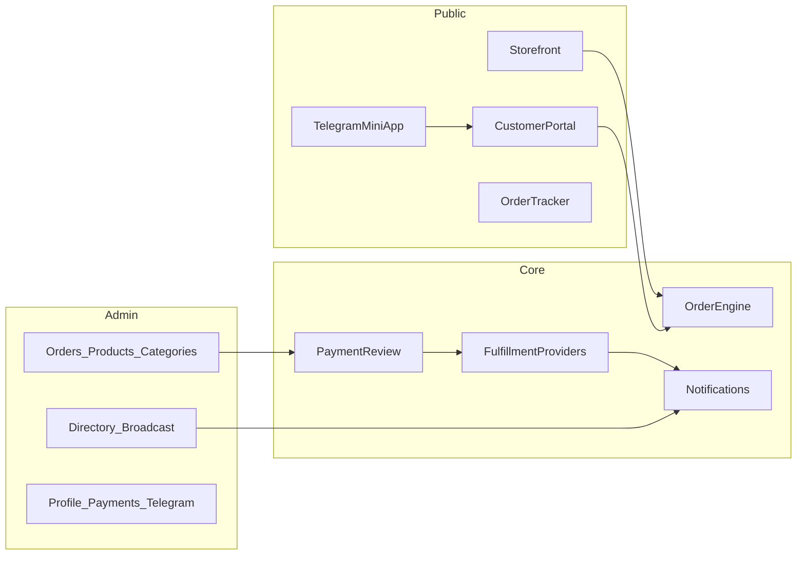
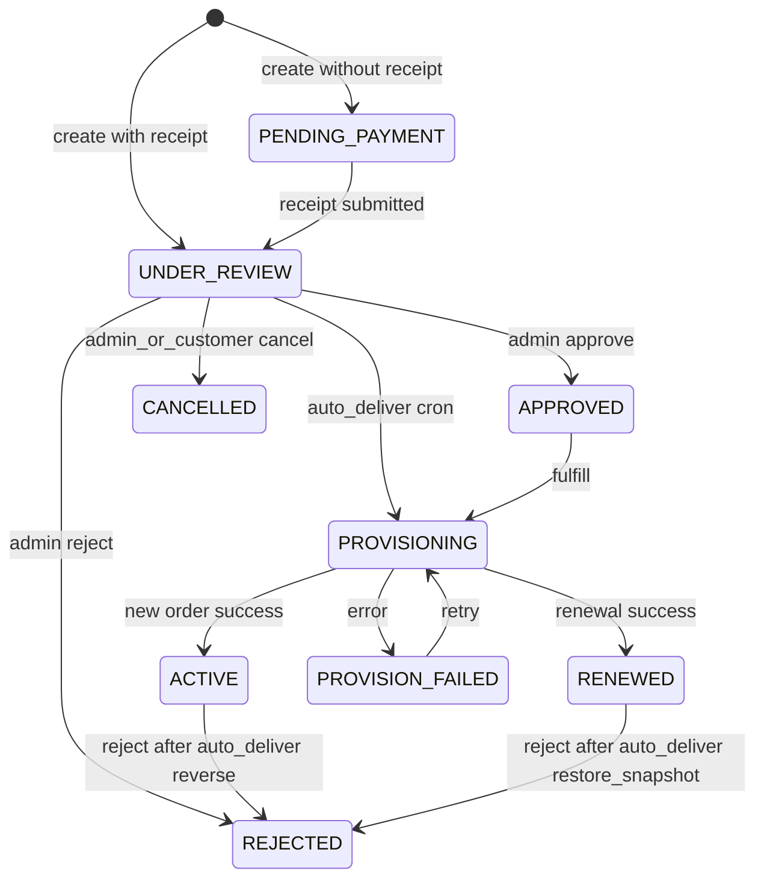

# NeoStore — Product Rebuild Specification

> Complete blueprint to recreate NeoStore from scratch.
> Domain-agnostic digital commerce + customer portal + Telegram ops.
> Fulfillment is pluggable (not tied to any VPN/panel vendor).

**Version:** 0.1.0-draft  
**Product name:** NeoStore  
**Audience:** engineers rebuilding or extending the platform

---

## 1. Vision & boundaries

### 1.1 What NeoStore is

NeoStore is a **standalone storefront platform** that lets an operator:

- Publish a branded public shop (`/shop/{slug}`)
- Sell digital products with categories, prices (USD / IRT), badges, renewals
- Collect **manual bank / card-to-card** payments with receipt review
- Fulfill orders through **pluggable providers** (manual delivery, code inventory, custom APIs, …)
- Give buyers a **customer portal** (permanent token + session)
- Run a **Telegram bot + Mini App** (customer + admin ops, broadcast)
- Track orders publicly (`/track/{code}`)
- Analyze revenue and segment customers

### 1.2 What NeoStore is not

- Not a VPN control plane
- Not dependent on any upstream panel product
- Not a full PSP gateway (v1 payment rail is manual bank; architecture stays method-pluggable)

### 1.3 Core vocabulary

| Term | Meaning |
|------|---------|
| **Store** | One operator storefront (slug, branding, payments, telegram) |
| **Category** | Merchandising group; also renewal compatibility gate |
| **Product** | Sellable SKU |
| **FulfillmentBlueprint** | How a product is delivered after payment approval |
| **Entitlement** | Live customer asset after fulfillment (account, code, license, access) |
| **AccessLink** | Customer-facing URL/code to use or reclaim an entitlement |
| **Customer** | Buyer identity + permanent portal token |
| **Order** | Purchase or renewal workflow unit |
| **Payment** | Payment evidence & review state for an order |
| **Timeline** | Append-only status history on an order |

---

## 2. Roles

| Role | Capabilities |
|------|----------------|
| **Admin** | Full store settings, catalog, order review, customer directory, broadcast, analytics |
| **Customer** | Browse shop, checkout, portal login, renew, claim entitlement, hide entitlement, cancel pending orders |
| **Telegram Admin Bot** | Bind admin chat, approve/reject orders, view revenue snapshot, compose broadcasts |
| **System / Cron** | Auto-deliver due orders; expiry/quota warning notifications |

---

## 3. High-level architecture



### Suggested monorepo

```
NeoStore/
  apps/api            # HTTP API + cron + telegram webhook
  apps/admin          # Operator dashboard
  apps/storefront     # Shop + portal + track + TMA shell
  packages/shared     # Types, enums, payment config helpers
  install/            # Independent install & update
  SPEC.md
```

---

## 4. Data model

### 4.1 Enums

**OrderStatus**

`PENDING_PAYMENT` → `PAYMENT_SUBMITTED` → `UNDER_REVIEW` → `APPROVED` → `PROVISIONING` → (`PROVISION_FAILED` | `ACTIVE` | `RENEWED`) | `REJECTED` | `CANCELLED` | `EXPIRED`

**PaymentMethod (v1)**  
`MANUAL_BANK`

**PaymentStatus**  
`PENDING` | `SUBMITTED` | `APPROVED` | `REJECTED` | `REFUNDED`

**EntitlementStatus (derived or stored)**  
`active` | `expired` | `disabled` | `depleted` | `pending_delivery`

### 4.2 StoreProfile (1 per operator account)

| Field | Type | Notes |
|-------|------|-------|
| id | uuid | PK |
| ownerId | uuid | Operator account (unique) |
| slug | string | Unique public key |
| domainId | uuid? | Optional custom domain |
| title, description, logo, theme | string/json | Presentation |
| paymentConfig | json | See §10 |
| bankName, bankCardNumber, bankCardHolder, bankIban | string? | Legacy mirrors of primary card |
| paymentInstructions, bankAccountInfo | string? | Legacy |
| supportLinks | json? | Often overridden by Branding |
| defaultCurrency | string | `USD` \| `IRT` |
| enabled | bool | Public store on/off |
| telegramBotEnabled | bool | |
| telegramBotTokenEnc | string? | Encrypted at rest |
| telegramBotUsername | string? | |
| telegramWebhookSecret | string? | Path secret |
| telegramWelcomeText | string? | |
| telegramAdminChatId | string? | |
| autoDeliverEnabled | bool | |
| autoDeliverDelayMinutes | int | 1–1440 |
| nextOrderNumber | int | Sequential tracking (~from 1000) |
| createdAt, updatedAt | datetime | |

### 4.3 Category

`id`, `ownerId`, `name`, `description?`, `icon?`, `sortOrder`, `visible`, `enabled`, timestamps

### 4.4 FulfillmentBlueprint

| Field | Notes |
|-------|-------|
| id, ownerId, name, description? | |
| providerType | `manual` \| `entitlement_code` \| `custom_http` \| … |
| providerConfig | json — provider-specific |
| renewalPolicy | json — how renewals extend entitlements |
| enabled | bool |

Examples of `providerConfig`:

```json
// manual
{ "instructions": "Deliver access details in portal notes after approve" }

// entitlement_code
{ "inventoryPoolId": "...", "codeFormat": "plain", "oneTime": true }

// custom_http
{ "createUrl": "https://provider.example/fulfill", "headers": { "Authorization": "…" } }
```

### 4.5 ProductTemplate (optional)

`id`, `ownerId`, `blueprintId?`, `name`, `description?`, `priceToman?`, `priceUsd`, `quotaUnits?`, `durationDays`, `extra?`

> Templates can clone into Products. UI may lag API.

### 4.6 Product

| Field | Notes |
|-------|-------|
| id, ownerId | |
| categoryId | Required |
| blueprintId | FulfillmentBlueprint |
| templateId? | |
| name, description? | |
| priceToman?, priceUsd | |
| quotaUnits | Generic quota (bytes/credits/seats — unit defined by blueprint) |
| durationDays | Access length |
| status | e.g. `active` |
| badge?, sortOrder, featured, visible, renewable | |
| maxQuantity? | |

### 4.7 Customer

| Field | Notes |
|-------|-------|
| id, ownerId | |
| token | Unique permanent portal token (`NS-XXXX-XXXX-XXXX` or similar) |
| name?, telegram?, telegramUserId?, telegramUsername? | |
| whatsapp?, email? | |
| status, notes? | |
| notificationPrefs | json |
| metadata | json — see below |
| lastSeenAt?, lastLoginAt?, loginCount | |
| Unique | `(ownerId, telegramUserId)` when telegramUserId set |

**`metadata` shape**

```json
{
  "linkedEntitlementIds": ["uuid", "..."],
  "hiddenEntitlementIds": ["uuid", "..."],
  "telegramAlerts": { "expiry:ENT_ID": 1710000000000 }
}
```

### 4.8 CustomerSession

`id`, `customerId`, `tokenHash` (SHA-256 of session token), `userAgent?`, `ipAddress?`, `createdAt`, `lastUsedAt`, `expiresAt` (default **14 days**), `revokedAt?`

Header: `x-customer-session: <raw session token>`

### 4.9 CustomerNotification / CustomerActivity

Notification: `id`, `customerId`, `type`, `title`, `message`, `payload` json, `readAt?`, `createdAt`  
Activity: `id`, `customerId`, `orderId?`, `type`, `title`, `message`, `metadata?`, `createdAt`

Unread notifications may collapse per `orderId` in UI.

### 4.10 Order

| Field | Notes |
|-------|-------|
| id | |
| trackingCode | Unique; sequential preferred |
| storeId, productId, customerId | |
| configName | Buyer-facing label / entitlement seed name |
| amount, currency | |
| status | OrderStatus |
| rejectReason?, provisionError?, notes? | |
| entitlementId? | Created/linked entitlement |
| isRenewal | bool |
| renewEntitlementId? | Target entitlement for renewals |
| autoDeliverAt?, autoDelivered, pendingReview | Auto-deliver flags |
| renewSnapshot | json — state before renewal for reject-rollback |
| timestamps | |

### 4.11 Payment

`id`, `orderId` (unique), `method`, `status`, `amount`, `currency`, `receiptText?`, `receiptImage?`, `metadata?`, `reviewedAt?`, `reviewedBy?`, `rejectReason?`

### 4.12 OrderTimelineEvent

`id`, `orderId`, `status` (string — may include `CREATED`, `CONFIRMED`, `AUTO_DELIVERED` beyond enum), `message`, `actor` (`customer`\|`admin`\|`system`), `metadata?`, `createdAt`

### 4.13 Entitlement

Live delivered asset (provider-agnostic):

| Field | Notes |
|-------|-------|
| id, ownerId, customerId? | customer may be linked later via claim |
| blueprintId?, productId?, orderId? | Provenance |
| label | Display name |
| externalRef? | Provider-side id |
| accessKey? | Public claim/redeem key (AccessLink material) |
| accessUrl? | Optional URL |
| enable | bool |
| quotaTotal, quotaUsed | Generic units (0 total = unlimited) |
| expiresAt | null/0 = no expiry |
| payload | json — provider secrets/details shown in portal as allowed |
| createdAt, updatedAt | |

### 4.14 Related optional modules

- **Brand**: logos, colors, footer, support links injected into public surfaces  
- **Domain**: custom hostname for store when verified + TLS ready  
- **InventoryPool / InventoryItem**: for `entitlement_code` provider

---

## 5. Order state machine



### 5.1 Checkout rules

- No receipt → `PENDING_PAYMENT` + payment `PENDING`
- With receipt → `UNDER_REVIEW` + payment `SUBMITTED`; if auto-deliver on → `pendingReview=true`, `autoDeliverAt=now+delay`
- Renewals **require** receipt
- Tracking code = sequential `nextOrderNumber` (fallback random unique)

### 5.2 Approve

- Normal: payment → `APPROVED`, then fulfill → `ACTIVE` / `RENEWED`
- Already approved / failed: approve retries fulfill
- Auto-delivered + `pendingReview`: approve only clears review (`CONFIRMED` timeline); do **not** send a second “payment approved” customer ping

### 5.3 Reject

- Before fulfill: mark rejected
- After auto-deliver: reverse fulfillment (delete new entitlement **or** restore `renewSnapshot`)

### 5.4 Auto-deliver (cron ~1 min)

Due when: `autoDeliverAt <= now`, `autoDelivered=false`, `pendingReview`, status in `UNDER_REVIEW|PAYMENT_SUBMITTED`  
Then fulfill, set `ACTIVE|RENEWED`, `autoDelivered=true`, keep `pendingReview`, notify customer + short admin ping

### 5.5 Cancelable (admin UI)

`PENDING_PAYMENT`, `PAYMENT_SUBMITTED`, `UNDER_REVIEW`, `APPROVED`, `PROVISIONING`, `PROVISION_FAILED`

### 5.6 Revenue

Count only orders with status `ACTIVE` or `RENEWED` and payment null or `APPROVED`.

---

## 6. Fulfillment Provider contract

```ts
interface FulfillmentProvider {
  type: string;

  /** Create entitlement for a new purchase */
  fulfillNew(ctx: FulfillContext): Promise<{ entitlementId: string; access?: AccessInfo }>;

  /** Extend / top-up an existing entitlement */
  fulfillRenewal(ctx: RenewContext): Promise<{ entitlementId: string }>;

  /** Undo auto-delivered new order */
  reverseNew?(ctx: ReverseContext): Promise<void>;

  /** Restore pre-renewal snapshot */
  reverseRenewal?(ctx: ReverseRenewContext): Promise<void>;

  /** Resolve AccessLink → entitlement (for claim/renew-by-link) */
  resolveAccessLink?(ownerId: string, link: string): Promise<{ entitlementId: string }>;
}
```

### 6.1 Built-in providers (v1)

1. **ManualDelivery** — marks entitlement `pending_delivery`; admin completes delivery in UI  
2. **EntitlementCode** — pops next unused code from inventory pool; exposes as AccessLink  

Providers must be isolated behind this interface so NeoStore never hardcodes a vendor panel.

### 6.2 Post-fulfill links

Always:

1. Set `Order.entitlementId`
2. Append entitlement id to `Customer.metadata.linkedEntitlementIds`
3. Emit timeline + customer notification (`service_ready` / subscription updated)

### 6.3 Renewal compatibility

Renew product **must** share the same **Category** as the last `ACTIVE`/`RENEWED` order for that entitlement.

---

## 7. Admin API

Base: `/api/admin` (or `/api/store` under admin auth)  
Auth: operator JWT

| Method | Path | Purpose |
|--------|------|---------|
| GET | `/dashboard` | KPIs: today/pending/new/completed, revenue, products, customers, renewals, slug |
| GET/PUT | `/profile` | Store settings |
| GET/POST | `/categories` | List/create |
| PATCH/DELETE | `/categories/:id` | Update/delete |
| GET/POST | `/blueprints` | Fulfillment blueprints |
| GET | `/blueprint-options` | Provider types + option schemas |
| PATCH/DELETE | `/blueprints/:id` | Update/delete |
| GET/POST | `/templates` | Product templates |
| PATCH/DELETE | `/templates/:id` | |
| POST | `/templates/:id/clone` | Clone → product (`categoryId`) |
| GET/POST | `/products` | |
| PATCH/DELETE | `/products/:id` | |
| GET | `/orders?status=` | |
| GET | `/orders/:id` | Detail + timeline/payment/entitlement |
| POST | `/orders/:id/approve` | |
| POST | `/orders/:id/reject` | body `{ reason? }` |
| POST | `/orders/:id/fulfill` | Manual (re)fulfill |
| POST | `/orders/:id/cancel` | |
| GET | `/customers?segment&search` | Segments below |
| GET | `/customers/:id` | Detail + entitlements (+ heal links) |
| PATCH | `/customers/:id/entitlements/:id` | Edit label/enable/quota/expiry/accessKey + optional Telegram notify |
| GET/PUT | `/telegram` | Bot settings |
| POST | `/telegram/test` | |
| POST | `/telegram/activate` | Register webhook |
| GET | `/analytics?range&groupBy&categoryId` | `7d\|30d\|90d\|365d`, `day\|week\|month` |
| GET | `/telegram/broadcast/preview?audience` | |
| POST | `/telegram/broadcast` | `{ text, audience, photoDataUrl? }` |

**Customer segments:** `all` | `new` | `with_service` | `without_service` | `telegram_only`

**Customer list `serviceCount`:** count **existing** entitlements only (orders + `linkedEntitlementIds` + heal via `configName`/label when FK missing). Never count dead IDs.

---

## 8. Public API

Base: `/api/public` or `/store`

| Method | Path | Auth | Purpose |
|--------|------|------|---------|
| GET | `/public/:slug` | — | Catalog + branding + payment cards |
| GET | `/public/by-domain` | Host / `?domain=` | Resolve store by custom domain |
| POST | `/public/:slug/customer` | body `token` | Lookup customer |
| POST | `/public/:slug/order` | CheckoutPayload | Guest/token checkout |
| GET | `/track/:code` | — | Order tracking (+ delivery when active) |
| POST | `/customer/session` | body `token` | Login → session |
| GET | `/customer/session` | session header | Dashboard |
| POST | `/customer/logout` | session | Revoke |
| POST | `/customer/notifications/:id/read` | session | |
| POST | `/customer/notifications/read-all` | session | |
| GET | `/portal/:token` | permanent token | Legacy portal |
| POST | `/portal/:token/renew` | | Renew checkout |
| POST | `/customer/renew` | session | Renew |
| POST | `/customer/order` | session | New purchase while logged in |
| POST | `/customer/orders/:id/cancel` | session | Cancel pre-fulfillment |
| POST | `/customer/entitlements/claim` | session + AccessLink | Attach existing |
| POST | `/customer/entitlements/:id/hide` | session | Hide from portal list only |
| POST | `/telegram/session` | `{ slug, initData }` | TMA silent login |
| POST | `/telegram/webhook/:slug/:secret` | Telegram | Bot updates |

### 8.1 Checkout payloads

```ts
CheckoutPayload = {
  productId: string;
  configName?: string;
  name?: string;
  telegram?: string;
  whatsapp?: string;
  email?: string;
  notes?: string;
  receiptText?: string;
  receiptImage?: string;
  customerToken?: string;
  haveToken?: boolean;
  isRenewal?: boolean;
  renewEntitlementId?: string;
  currency?: string;
};

RenewCheckoutPayload = {
  entitlementId?: string;
  accessLink?: string;
  productId: string;
  receiptText?: string;
  receiptImage?: string;
  notes?: string;
  currency?: string;
};

ClaimPayload = { accessLink: string };
```

### 8.2 Rate limits (suggested, per IP/key, 10 min window)

| Key | Limit |
|-----|-------|
| checkout | 10 |
| tracking | 120 |
| customerLookup | 20 |
| customerLogin | 15 |
| renewal | 12 |
| claim | 15 |
| telegramSession | 30 |
| telegramWebhook | 120 |

---

## 9. Customer portal

### 9.1 Auth

1. Permanent token printed at checkout / Telegram (`NS-…`)
2. `POST /customer/session` → session cookie/header (14d)
3. Portal dashboard loads entitlements, orders, notifications, renew-compatible products

### 9.2 Tabs

`home` | `orders` | `alerts` (+ buy / renew sheets)

### 9.3 Entitlement actions

- View quota / expiry / access
- Renew (category-compatible products + receipt)
- Claim via AccessLink
- Hide from list (metadata only — does not delete)

### 9.4 Admin customer drawer

Must show:

1. Profile (token, telegram, contacts, stats)
2. Entitlements list (status, quota bar, expiry, access key copy, edit)
3. Orders list (click focuses entitlement)

Heal broken links: if order is `ACTIVE`/`RENEWED` with `configName` but missing entitlement FK, resolve by label/externalRef and re-attach.

---

## 10. Settings shapes

### 10.1 Store profile PUT

```ts
{
  title: string;
  slug: string;
  description?: string;
  enabled: boolean;
  domainId?: string | null;
  defaultCurrency: "USD" | "IRT";
  autoDeliverEnabled: boolean;
  autoDeliverDelayMinutes: number; // 1..1440
  paymentConfig: {
    methods: { manual_bank: boolean };
    cards: Array<{
      id: string;
      bankName: string;
      cardNumber: string;
      cardHolder: string;
      iban?: string;
      instructions?: string;
      enabled?: boolean;
    }>;
  };
  bankName?: string;
  bankCardNumber?: string;
  bankCardHolder?: string;
  bankIban?: string;
  paymentInstructions?: string;
  bankAccountInfo?: string;
}
```

### 10.2 Telegram PUT

```ts
{ enabled?: boolean; botToken?: string; welcomeText?: string; adminChatId?: string }
```

Webhook: `{PUBLIC_BASE}/store/telegram/webhook/{slug}/{secret}`  
Mini App URL: `{customDomain|base}/shop/{slug}?tg=1`

### 10.3 Branding (separate module)

Injected into public store/portal/track: `name`, `logo`, `logoDark`, `primaryColor`, `accentColor`, `footerText`, `theme`, `supportLinks`.

---

## 11. Admin UI inventory

| Top tab | Sub-tabs | Content |
|---------|----------|---------|
| Overview | Summary, Analytics | KPIs + recent orders; charts |
| Commerce | Orders, Products, Categories, Blueprints | CRUD + order actions |
| Customers | Directory, Broadcast | Segments, search, detail drawer, Telegram broadcast |
| Settings | Profile, Payments, Cards, Telegram | Store meta, methods, cards, bot |

### Public routes

| Route | Role |
|-------|------|
| `/shop/[slug]` | Checkout wizard |
| `/shop/[slug]/portal` | Login |
| `/shop/[slug]/portal/dashboard` | Portal |
| `/portal`, `/portal/dashboard` | Global portal (remembered slug) |
| `/portal/[token]` | Deep link |
| `/track/[code]` | Public tracker |

TMA uses the same responsive UI + silent Telegram login — not a second storefront.

---

## 12. User journeys

### Admin

1. Install NeoStore → create operator → create store profile (slug, currency, cards)
2. Categories → Fulfillment blueprints → Products
3. Optional: Telegram bot activate, custom domain, auto-deliver
4. Review orders → approve/reject/fulfill; or confirm auto-delivered
5. Customers → inspect entitlements, broadcast, analytics

### Customer (web)

1. Open shop → choose product → enter label/contact → pay → upload receipt → tracking + permanent token  
2. Login portal with token → entitlements/orders/alerts  
3. Renew / claim / hide / cancel pending  

### Customer (Telegram)

1. `/start` → welcome + entitlements + Open Mini App + token message  
2. Mini App → session → portal  

### Telegram admin

| Input | Behavior |
|-------|----------|
| `/start` (admin) | Admin home |
| `/admin`, `/setadmin` | Bind admin chat |
| `approve:{orderId}` / `reject:{orderId}` | Order actions |
| `admin:orders\|revenue\|broadcast` | Menus |
| `broadcast:aud:{all\|with_service\|without_service}` | Audience |
| `broadcast:confirm\|cancel` | Send/cancel |

Hourly alerts: expiry ≤ 1 day; remaining quota ≤ threshold; cooldown ~20h per key in metadata.

### Notification types

`order_submitted`, `renewal_submitted`, `order_approved`, `payment_rejected`, `subscription_updated` / ready, `provisioning_issue`, `order_cancelled`, `expiry_warning`, `quota_warning`

---

## 13. Analytics

- Ranges: `7d` | `30d` | `90d` | `365d`
- Group: `day` | `week` | `month`
- Optional `categoryId`
- Series: revenue, orders, renewals (ACTIVE/RENEWED only)

---

## 14. Security & ops

- Encrypt Telegram bot tokens at rest
- Hash customer session tokens (store only hash)
- Validate Telegram `initData` HMAC for TMA login
- Webhook path includes unguessable `secret`
- Rate-limit all public mutating endpoints
- Independent installer: Node 20+, Postgres (or SQLite for small installs), env file, migrate, systemd/docker optional
- Update script: pull release / migrate / restart — **separate from any other product**

---

## 15. Implementation phases

| Phase | Deliverable |
|-------|-------------|
| 0 | Repo + SPEC + monorepo stubs (**this**) |
| 1 | Operator auth, Store profile, Categories, Products, Blueprints |
| 2 | Checkout, payments, order machine, admin review UI |
| 3 | Providers: Manual + EntitlementCode; reverse/auto-deliver |
| 4 | Customer portal + sessions |
| 5 | Telegram bot + Mini App + broadcast + alerts |
| 6 | Analytics, custom domain hooks, polish install/update |

---

## 16. Acceptance checklist (parity with intended store UX)

- [ ] Public shop by slug with categories & products  
- [ ] Manual bank cards + receipt upload  
- [ ] Admin approve → entitlement created via blueprint  
- [ ] Auto-deliver + pending review confirm/reject with reverse  
- [ ] Customer permanent token + portal dashboard  
- [ ] Renew with category gate + receipt  
- [ ] Claim by AccessLink; hide entitlement  
- [ ] Public tracking page  
- [ ] Telegram Mini App silent login  
- [ ] Admin bot approve/reject + broadcast audiences  
- [ ] Customer directory shows correct entitlement counts (list = detail)  
- [ ] Analytics for ACTIVE/RENEWED revenue  
- [ ] Standalone install & update without other products  

---

## 17. Naming defaults for NeoStore

| Item | Default |
|------|---------|
| Product | NeoStore |
| Permanent token prefix | `NS-` |
| Default timezone display | `Asia/Tehran` (configurable) |
| Session TTL | 14 days |
| Auto-deliver delay | operator-configured minutes |
| Currencies | USD, IRT (Toman display) |

---

*End of specification.*
