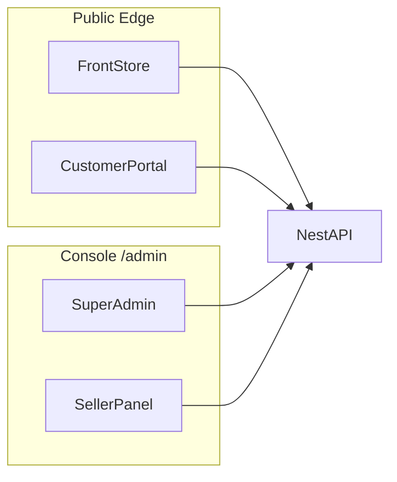

# Phase 1 — Surfaces, Roles & Front Store Architecture

**Status:** Binding for Phase 1 UI work  
**Date:** 2026-08-02  
**Supersedes:** ad-hoc storefront/admin shells

---

## 1. Decisions (locked)

| Decision | Choice | Why |
|----------|--------|-----|
| First slice | Design System + Front Store (shop + customer portal shell) | Highest user-facing quality leverage |
| Product model | **Hybrid surfaces** (conceptual B, deploy A) | Clear Super / Seller / Customer boundaries without 3 deployables yet |
| Role switching | First-class **Active Context** | Same person can be customer + seller + (rare) platform ops |
| Business logic | Backend only | Frontends render + call APIs |
| Extensions | Host-ready; no Phase 2 Plugin Manager in P1 UI | Prepare seams, don’t build marketplace of plugins |

---

## 2. Surfaces (logical apps)



| Surface | Audience | Deploy target (Phase 1) | Base path |
|---------|----------|-------------------------|-----------|
| **Front Store** | Anonymous + customers | `apps/storefront` | `/` |
| **Customer Portal** | Authenticated customers | `apps/storefront` | `/portal` |
| **Seller Panel** | Workspace owner/admin/operator | `apps/admin` | `/admin/w/[workspaceId]` |
| **Super Admin** | Platform operators | `apps/admin` | `/admin/platform` |

**Future split:** Each surface can become its own Next app without rewriting domain modules — only routing/shell moves. Shared UI lives in `packages/ui`.

---

## 3. Identity & Active Context

### Roles (existing)

`super_admin` · `workspace_owner` · `workspace_admin` · `operator` · `customer`

### Active Context (new UX concept)

A signed-in principal may hold multiple memberships. UI never assumes one role forever.

```ts
type ActiveContext =
  | { kind: 'customer' }
  | { kind: 'seller'; workspaceId: string }
  | { kind: 'platform' };
```

- **Role Switcher** (header / account menu): switch context without re-login when entitlements allow.
- Tokens stay the same; context is a client preference + server authorization still re-checked per request.
- Ordinary users: typically `customer` only. Sellers see Seller + Customer. Platform ops see Platform (+ optional Seller).

### Security model

- JWT carries `sub`, `role`, workspace memberships.
- Every admin API: AuthN + AuthZ (workspace membership or `super_admin`).
- Portal APIs: customer session (cookie/JWT) only.
- Front Store public reads: no secrets; rate-limited.
- No business rules in React (price, stock, fulfillment, commissions).

---

## 4. Design System (`packages/ui`)

### Goals

Premium SaaS polish (Linear / Stripe / Vercel *level*, not clone). One token set for Store + Portal + Admin shells.

### Tokens

- **Color:** ink / surface / muted / border / accent / danger / success / warning  
- **Type:** display + sans (no Inter / Roboto / Arial defaults; no cream+Georgia+terracotta cluster)  
- **Space:** 4px grid (4–48)  
- **Radius:** sm / md / lg / xl  
- **Shadow:** soft elevation only (1–2 levels)  
- **Motion:** 150 / 250 / 400ms, shared easings  
- **Icons:** SVG only (`packages/ui` icon set)

### Primitives (Phase 1)

`Button` · `Input` · `TextArea` · `Select` · `Badge` · `Card` · `Skeleton` · `Avatar` · `Icon` · `Toast` · `Dialog` · `Tabs` · `BottomNav` · `EmptyState` · `PageHeader`

Components are presentational; containers in apps own data fetching.

---

## 5. Front Store — modules & routes

### Information architecture

| Route | Purpose | API |
|-------|---------|-----|
| `/` | Primary shop home | `GET /api/public` or `/api/public/:slug` |
| `/c/[categoryId]` | Category | public catalog filter (client until dedicated endpoint) |
| `/p/[productId]` | Product detail | from catalog payload / future `GET /api/public/:slug/products/:id` |
| `/search` | Search + filters | client filter Phase 1; server search later |
| `/checkout` | Checkout | `POST /api/public/:slug/order` |
| `/track/[code]` | Order track | `GET /api/track/:code` |
| `/portal/*` | Customer shell | `/api/customer/*` |
| `/[slug]` | Named shop (multi-tenant URL) | `GET /api/public/:slug` |

### User flows (Phase 1)

1. **Browse → Detail → Buy → Track**  
2. **Portal:** session → orders / downloads / profile (wallet UI shell; ledger APIs as available)  
3. **Telegram:** later Mini App shell reuses same portal routes (`?tg=1`)

### Out of Phase 1 UI (architecture reserved, not built)

Wishlist · Reviews · Tickets · Referral · Full multi-crypto wallet rails · Website CMS · Seller onboarding marketplace

---

## 6. Database / API impact (Phase 1)

**No schema break required** for DS + Front Store redesign.

Optional later (document only):

- `StoreProfile.themeTokens` JSON for white-label  
- `UserPreference.activeContext`  
- Dedicated `GET /api/public/:slug/products/:id`  
- Full-text search index  

Seed + `STORE_SLUG` empty → primary shop via `GET /api/public` (already designed).

---

## 7. Admin scaffolding (prep only in this slice)

- Route groups: `platform/` vs `w/[workspaceId]/`  
- Role Switcher stub reading JWT memberships  
- Full Super/Seller CRUD modules: **next slice** after Store ships polish

---

## 8. Phase gates

| Gate | Done when |
|------|-----------|
| G1 | `packages/ui` tokens + primitives consumed by storefront |
| G2 | Home / category / product / search / checkout feel premium + mobile bottom nav |
| G3 | `/portal` shell with real session hooks (even if some panels are empty states) |
| G4 | Admin has platform vs workspace route split + switcher stub |
| G5 | No business logic in UI; no temporary hacks in Core |

---

## 9. Non-goals (this slice)

- Rewriting Nest domain to full DDD/CQRS folders  
- BullMQ worker app split  
- Extension Plugin Manager UI  
- Pixel-perfect Telegram Mini App (reuse portal later)

---

## 10. Implementation order

1. Architecture doc (this file)  
2. `packages/ui`  
3. Storefront shell + home  
4. Product / category / search / checkout  
5. Portal shell  
6. Admin role surface scaffolding
