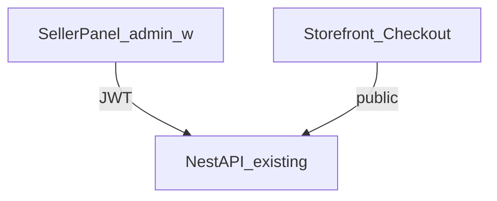

# Phase 2 — Seller Panel & Checkout Architecture

**Status:** Binding for Phase 2  
**Depends on:** [ARCHITECTURE-PHASE1-UI.md](./ARCHITECTURE-PHASE1-UI.md)  
**Date:** 2026-08-02

---

## 1. Scope (locked)

| In scope | Out of scope |
|----------|----------------|
| Seller Panel modules wired to **existing** Nest APIs | New Nest endpoints unless a hard blocker |
| Products · Orders · Customers · Settings · Analytics · Wallet preview · Telegram settings | Settlement payouts, inventory pools, media CDN |
| Multi-step Front Store checkout (payment method + receipt) | Wishlist / reviews / tickets |
| Reuse `@neostore/ui` | Plugin Manager / Extension marketplace (product Phase 2 SDK UI) |

**Product roadmap note:** Master roadmap “Phase 2 = Extension SDK” remains deferred. This slice is **Core Marketplace continuity** (Seller + Checkout). Extension Host stays prepared; no Plugin Manager UI.

---

## 2. Surfaces

| Module | Routes (`basePath /admin`) | APIs |
|--------|----------------------------|------|
| Dashboard | `/w/[workspaceId]` | `GET .../dashboard`, `GET .../analytics` |
| Products | `/w/[workspaceId]/products`, `.../products/new`, `.../products/[id]` | products + categories + blueprints |
| Orders | `/w/[workspaceId]/orders`, `.../orders/[id]` | list/detail/approve/reject/fulfill |
| Customers | `/w/[workspaceId]/customers`, `.../customers/[id]` | list/detail |
| Analytics | `/w/[workspaceId]/analytics` | analytics series |
| Wallet | `/w/[workspaceId]/wallet` | settlement-preview only |
| Settings | `/w/[workspaceId]/settings` | profile PATCH + telegram POST |
| Checkout | storefront `/checkout?productId=` (+ slug variants) | `POST /public/:slug/order` |

---

## 3. Frontend architecture

- **No business logic in UI** — approve/reject/fulfill/pricing decided by API.
- **`lib/api.ts`** — typed fetch wrapper with Bearer token; surfaces errors.
- **Seller shell** — sidebar (desktop) + sticky top + mobile bottom/section nav; Role Switcher retained.
- **Auth guard** — client redirect to `/` login if no session; workspace membership must match `workspaceId` param (or `super_admin`).

---

## 4. Checkout user flow

1. Product detail → **Buy** → `/checkout?productId=`
2. Step 1: contact (name, email optional)
3. Step 2: payment method from `store.paymentConfig.methods` (fallback: manual_bank)
4. Step 3: receipt text if manual_* ; then submit
5. Success: tracking code + link to `/track/[code]` + customer token display if returned

---

## 5. Security

- JWT on every seller request; workspace membership enforced server-side.
- Checkout remains public; no secrets in client.
- Never show bot tokens after save (mask in UI); send only on change.
- Receipt text is user content — rendered as text, not HTML.

---

## 6. Explicit non-goals / debt ban

- Do not invent client-side commission or order status machines.
- Do not stub settle/payout buttons that call missing APIs.
- Wallet page = preview + empty state for ledger (honest).
- Blueprint update/delete UI omitted until APIs exist (create + list only).

---

## 7. Acceptance gates

| Gate | Done when |
|------|-----------|
| G1 | Seller can list/create/edit product visibility & prices |
| G2 | Seller can approve/reject/fulfill orders |
| G3 | Seller can browse customers |
| G4 | Settings update store profile + telegram fields |
| G5 | Checkout places real order with chosen payment method |
| G6 | Admin + storefront production builds succeed |
