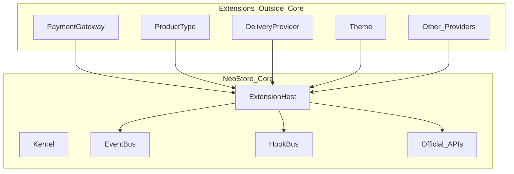

# NeoStore — Extension SDK & Plugin Architecture

**Document:** EXTENSIONS v1.0  
**Status:** Binding architecture (design from day one; full Plugin Manager ships in Platform v2 / Phase 2)  
**Parent:** [`../SPEC.md`](../SPEC.md)

---

## 1. Vision

From **Platform v2** onward, NeoStore must become a fully extensible platform.

**Not** a WordPress-style “edit core / drop PHP files” model.

**Inspired by:** Visual Studio Code · Home Assistant · Grafana · Strapi

**Goal:** Capabilities grow through **Extensions**. The Core stays small, stable, testable, and independent. **No extension may modify Core.**



---

## 2. Core rules (non-negotiable)

Extensions **MUST**:

- Run **outside** Core (separate package / process boundary as defined by Extension Host)
- Communicate **only** via the **Extension SDK** (interfaces, events, hooks, official APIs)

Extensions **MUST NOT**:

- Change Core source files  
- Access the database directly  
- Override / patch Core source  
- Run arbitrary OS scripts on the host  
- Bypass the permission model  

Violations → refuse enable / unload / quarantine.

---

## 3. Extension types

Each extension has **one primary responsibility**:

| Type | Responsibility |
|------|----------------|
| `payment_gateway` | Accept / verify payments |
| `product_type` | Product schema, UI fields, validation |
| `delivery_provider` | Fulfill / reverse / resolve access links |
| `email_provider` | Send email |
| `notification_provider` | Push/Telegram/etc. channels |
| `auth_provider` | Login methods |
| `theme` | Storefront / portal presentation |
| `widget` | Dashboard / shop widgets |
| `report` | Custom reports |
| `importer` | Data import |
| `exporter` | Data export |
| `integration` | Third-party sync |
| `automation` | Rules / workflows |
| `ai_provider` | AI assistants |
| `analytics` | Analytics sinks |
| `shipping_provider` | Physical shipping |

First-party (Official) extensions may ship in `extensions/official/*` but still load through the same Host — **not** hardcoded into Core business modules (except thin registration of built-ins at boot).

---

## 4. Marketplace SDK (`@neostore/sdk`)

Official developer kit:

- TypeScript **Interfaces**  
- **Events** catalog  
- **Hooks** catalog  
- Client wrappers for **Official APIs**  
- **CLI** (`neostore ext create|validate|test|pack`)  
- Documentation  
- Examples  
- Testing utilities (mock host, event recorder)

Developers build extensions **without** forking Core.

---

## 5. Event system (event-driven Core)

Core emits domain events. Extensions **subscribe**; they do not invent private Core mutations.

### Example events

- `UserCreated`  
- `CustomerRegistered`  
- `OrderCreated`  
- `PaymentCompleted`  
- `ProductPurchased`  
- `ProductUpdated`  
- `WalletDeposited`  
- `TicketOpened`  
- `SettlementPaid`  

**Contract:** events are versioned, immutable payloads, delivered at-least-once via the Host (sync for critical hooks path; async queue for side effects).

---

## 6. Hook system

Official hooks let extensions **extend behavior** at defined points (ordered, permission-checked, timeout-bounded).

### Example hooks

- `beforeOrderCreate` / `afterOrderCreate`  
- `beforePayment` / `afterPayment`  
- `beforeWalletDeposit` / `afterWalletDeposit`  
- `beforeLogin` / `afterLogin`  
- `beforeFulfillment` / `afterFulfillment`  

Hooks may return structured results (e.g. veto with reason, mutate DTO within schema allow-list). They must not hang the request beyond Host limits.

---

## 7. Plugin manifest

Every extension **requires** `neostore.extension.json` (or `manifest.json`). Without it → not installable.

```json
{
  "id": "com.example.cryptomus",
  "name": "Cryptomus Gateway",
  "description": "Accept payments via Cryptomus",
  "author": "Example Co",
  "version": "1.2.0",
  "type": "payment_gateway",
  "compatibility": {
    "minCore": "2.0.0",
    "maxCore": "2.x"
  },
  "permissions": ["payment", "settings", "webhook"],
  "dependencies": [],
  "homepage": "https://example.com",
  "repository": "https://github.com/example/neostore-cryptomus",
  "entry": "./dist/index.js",
  "ui": { "admin": "./dist/admin.js" }
}
```

Required fields: Name · Description · Author · Version · Compatibility · Permissions · Dependencies · Minimum Core Version · Homepage · Repository · Entry · Type.

---

## 8. Permissions

Extensions declare required permissions. Admin sees them **before** enable.

Examples: `payment` · `notification` · `settings` · `products` · `orders` · `reports` · `storage` · `webhook` · `users`

Host enforces: SDK calls outside granted permissions throw `PermissionDenied`.

---

## 9. Official APIs (no direct DB)

Extensions talk **only** to Core APIs exposed by the Host:

| API | Purpose |
|-----|---------|
| User API | Users / roles (scoped) |
| Product API | Catalog |
| Order API | Orders / timeline |
| Wallet API | Ledger operations |
| Payment API | Payment intents / status |
| Notification API | Notify channels |
| Storage API | Files / signed URLs |
| Logger API | Structured logs |
| Settings API | Extension + workspace settings |
| Event API | Emit allowed custom events (namespaced) |

No Prisma / SQL / Redis raw access from extension code.

---

## 10. Plugin Manager (Admin → Extensions)

UI sections:

- Installed  
- Available  
- Updates  
- Disabled  
- Official  
- Community  

### Install flow (v1 of Plugin Manager)

**Git repository only** (v1):

1. Admin pastes repo URL  
2. Host clones into isolated extensions directory  
3. Validate Manifest  
4. Check Core version compatibility  
5. Show Permissions for approval  
6. Resolve Dependencies  
7. Register extension  
8. Enable (if approved)  

Later: official Extension Marketplace (publish, versions, docs, monetization).

---

## 11. Security pipeline (before enable)

1. Manifest validation  
2. Version / compatibility validation  
3. Permission validation  
4. Dependency validation  
5. Integrity check (checksum lockfile)  
6. **Signature validation** (later versions)  
7. Sandbox / process isolation policy (Host-defined)  

Failed step → do not enable.

---

## 12. Theme SDK

Themes are extensions of type `theme`:

- Install / activate / deactivate / update / remove  
- No Core CSS/HTML forks  
- Tokens + layout slots published by Core storefront  

---

## 13. Payment SDK

**All payment gateways are extensions.**  

Core never hardcodes Cryptomus/Stripe/etc. as permanent modules — P0 may ship **official** gateway extensions that load via Host at boot, still implementing `payment_gateway` interface.

---

## 14. Product Type SDK

**All product types are extensible.**  

New types (e.g. custom “Game Top-Up”) register schemas + admin/storefront field components through `product_type` extensions — without Core changes.

---

## 15. Delivery / other SDKs

Same pattern for:

- `delivery_provider` (maps to FulfillmentBlueprint providers in SPEC)  
- `email_provider` · `notification_provider` · `auth_provider` · `shipping_provider` · …

---

## 16. Relation to P0 / P1 / Phase 2

| Stage | What we build |
|-------|----------------|
| **P0 (now)** | Core + **Extension Host skeleton** + **Official APIs stubs** + first-party extensions loaded as plugins (`manual` delivery, `manual_bank`, `cryptomus`, base product types). Event/Hook buses exist even if few subscribers. |
| **P1** | Wallet/Settlement emit events; more official extensions |
| **Phase 2 / Platform v2** | Full Plugin Manager UI · Git install · CLI · public `@neostore/sdk` · community catalog · signature checks · Theme/Payment/Product SDKs documented for 3rd parties |
| **Later** | Official Extension Marketplace + monetization |

**Architectural rule for P0 coding:** put gateway/type/delivery logic behind interfaces registered with Extension Host — do not bury them as irreversible Core singletons.

---

## 17. Acceptance (Phase 2)

- [ ] No extension can write Core files or open DB  
- [ ] Manifest + permissions gate enablement  
- [ ] Git install flow works end-to-end  
- [ ] Payment / Product Type / Delivery / Theme only via extensions  
- [ ] Events + Hooks documented and testable via SDK  
- [ ] Admin Extensions page: installed / available / updates / disable  
- [ ] Official SDK package published for developers  

---

## 18. Development goal

An ecosystem where **new capabilities arrive as Extensions**, not Core forks.

> Core = small, stable, testable, independent.  
> Future = built on the official SDK.
